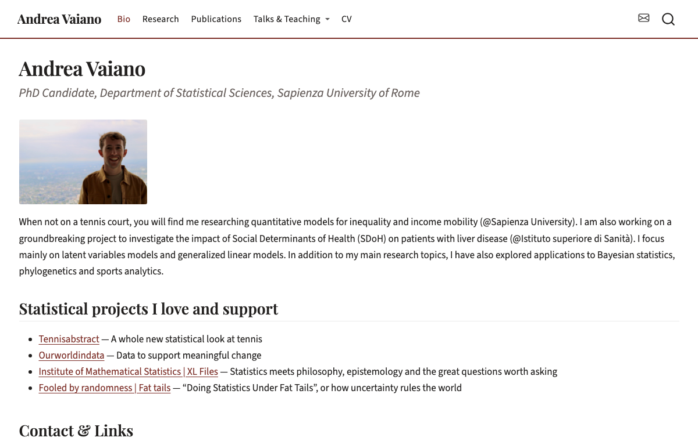

# Andrea Vaiano — personal academic website

The source for my personal website, built with [Quarto](https://quarto.org) and R.
**Live at [andreavaiano.github.io](https://andreavaiano.github.io)** *(update this once the
site is published).*



I'm a PhD candidate in statistics at Sapienza University of Rome. This repository is
public because the setup solves a problem a lot of academics have — keeping a CV, a
publication list and a website in sync — and there's no reason to make anyone else solve
it from scratch. **If you like it, take it.** See [Use this as a template](#use-this-as-a-template).

## What's interesting here

Most academic site templates ask you to maintain your CV twice: once in LaTeX for the PDF
everyone asks for, and again in HTML or YAML for the website. They drift apart within a
semester.

Here, **the LaTeX CV is the only source**:

- `cv_source/*.tex` is a [europasscv](https://ctan.org/pkg/europasscv) CV. The website
  parses it at render time and builds the CV page from it. Edit the `.tex`, re-render,
  and the site follows.
- `cv_source/bibliocv.bib` is cited by that same `.tex` *and* generates the publications
  page. One BibTeX entry updates the PDF and the website together.
- `cv_source/build-pdf.sh` compiles the downloadable PDF from the same file.

Both parsers are in `R/` and use **base R only** — no packages to install, nothing to
break in six months.

## Use this as a template

Click **Use this template** on GitHub (or just fork it), then work through this list.
None of it requires knowing Quarto — it's all text files.

**Replace my content:**

| File | What to change |
|---|---|
| `_quarto.yml` | Site title, navbar, email address in the contact icon |
| `index.qmd` | Bio, contact links, the "projects I love" list |
| `images/profile.jpg` | Your photo (keep the filename or update `index.qmd`) |
| `research.qmd` | Datasets, past projects, future ideas |
| `talks/*.qmd` | Teaching, seminars, conferences |
| `cv_source/` | **Your** `.tex` CV and `.bib` — then update the filename in `cv.qmd` |
| `images/site-preview.png` | Delete it, or screenshot your own |

**Then check it renders:**

```bash
quarto preview
```

**A note on the CV parser.** It reads `europasscv` macros (`\ecvsection`, `\ecvtitle`,
`\ecvtitlelevel`, `\ecvitem`). If your CV uses a different class — `moderncv`,
`altacv`, a hand-rolled one — `R/parse_europasscv.R` is about 150 commented lines and
adapting it means changing the macro names in one list. That's the intended
customisation point, not a fork-and-rewrite.

If you'd rather not parse LaTeX at all, delete the code chunk in `cv.qmd` and write the
page by hand — nothing else depends on it.

## How it works

### Look & feel

The theme is a custom Sass file, `editorial.scss`: Playfair Display serif headings over a
Source Sans 3 body, deep burgundy (`#7b2d26`) accent, white navbar with an accent rule
beneath it. Both fonts load from Google Fonts. To change the accent colour or the
typefaces, edit the variables in the `scss:defaults` block at the top of that file.

Talks, teaching and past projects use `.entry` blocks (styled in `styles.css`) rather than
tables — a bold title line, a muted detail line, then optional body text. To add an entry,
copy an existing `::: {.entry} ... :::` block.

### Structure

| Path | Purpose |
|---|---|
| `index.qmd` | Bio, contact links, "Statistical Projects I Love" |
| `research.qmd` | Single page: Data, Past Projects & Theses, Future Research Ideas |
| `publications.qmd` | Generated from `cv_source/bibliocv.bib` |
| `talks/` | Teaching (TA), seminars, conferences |
| `cv.qmd` | CV page — generated from the LaTeX CV |
| `cv_source/` | The LaTeX CV (`.tex` + `bibliocv.bib`) and `build-pdf.sh` |
| `R/` | `parse_europasscv.R` and `parse_bib.R`, the two parsers |
| `noice/` | Blog — currently on hold |

### The CV

`cv_source/CV_Andrea_Vaiano_no_dati.tex` is the single source of truth. The CV page reads
it at render time and lays out every section it finds, so updating the CV means editing
the `.tex` and re-rendering — nothing on the website needs touching.

`R/parse_europasscv.R` reads four macros and ignores everything else:

| Macro | Becomes |
|---|---|
| `\ecvsection{Name}` | a section heading |
| `\ecvtitle{Dates}{Title}` | an entry |
| `\ecvtitlelevel{Dates}{Title}{Level}` | an entry, level in parentheses |
| `\ecvitem{}{Text}` | a detail line under the current entry |

Anything commented out with `%` is skipped, so entries you've hidden in the PDF stay off
the website too. `\textit`, `\textbf`, `` ``quotes" `` and `--` dashes are converted.

If you start using a macro the parser doesn't know, its content simply won't appear —
check the page after adding one. A section whose entries all use unknown macros is
dropped entirely (this is what happens to Personal skills, which uses the language
macros).

To rebuild the downloadable PDF from the same source:

```bash
./cv_source/build-pdf.sh
```

That runs pdflatex → biber → pdflatex twice and copies the result to `cv.pdf` at the
project root, which is what the page's "Download PDF" button links to. LaTeX build
artefacts in `cv_source/` are gitignored; `cv.pdf` is committed so the published site
always has one.

#### Hiding a CV section from the website

Some sections are better served by their own page. `cv.qmd` has a `skip_sections` vector
near the top:

```r
skip_sections <- c("Conferences and Seminars")
```

Names must match the `\ecvsection{...}` text exactly. Remove a name to bring the section
back; add one to hide it. The `.tex` is untouched either way, so the PDF still has
everything.

### Publications

`publications.qmd` is generated from `cv_source/bibliocv.bib` — the same file the LaTeX
CV cites. Add a BibTeX entry there and it appears on both the PDF and the website.

`R/parse_bib.R` groups entries by year, newest first, formats authors as initials plus
surname with one surname in bold (set via the `highlight` argument), and links the `doi`
field when present. It understands `@article` (journal, volume, number, pages) and
`@techreport` (series, number); anything else falls back to `booktitle` / `publisher` /
`institution`.

### The blog

`noice/` is on hold. The files are still in the repo but the site does not build or
publish them, via this line in `_quarto.yml`:

```yaml
project:
  render:
    - "**/*.qmd"
    - "!noice/**"
```

To bring the blog back: delete the `"!noice/**"` line and uncomment the two `noice`
lines in the navbar further down the same file. Nothing else is needed — the listing
page and the starter post are untouched.

## Working on it locally

Open `academic-website.Rproj` in RStudio, or:

```bash
quarto preview
```

Note that changes to `_quarto.yml` need a preview restart — Quarto doesn't hot-reload the
site config.

## Publishing

Deployed to GitHub Pages. After the one-time setup below, updates are:

```bash
quarto publish gh-pages
```

That renders locally and pushes the output to the `gh-pages` branch. Rendering happens on
your machine, so no CI configuration is needed — which matters here, because the site
runs R at render time.

## Requirements

- **Quarto** and **R** to render the site. Base R only — no packages.
- **LaTeX** with the `europasscv` class and `biber`, only if you want to rebuild `cv.pdf`.

## Licence and credits

The site's code — the Quarto configuration, the theme, the two R parsers, the CSS — is
released under the [MIT licence](LICENSE). Use it, change it, no need to ask.

**Not covered by that licence:** my personal content. The bio text, photo, CV, publication
list, project descriptions and research notes are mine. Replace them with your own rather
than shipping a site that describes me.

`images/Rlogo.svg` is the official R logo from
[r-project.org](https://www.r-project.org/logo/), © 2016 The R Foundation, used under
[CC-BY-SA 4.0](https://creativecommons.org/licenses/by-sa/4.0/). It appears in the site
footer, linked back to r-project.org. If you remove the footer credit, remove the file
too.

If this saved you an afternoon, a link back is welcome but not required.
